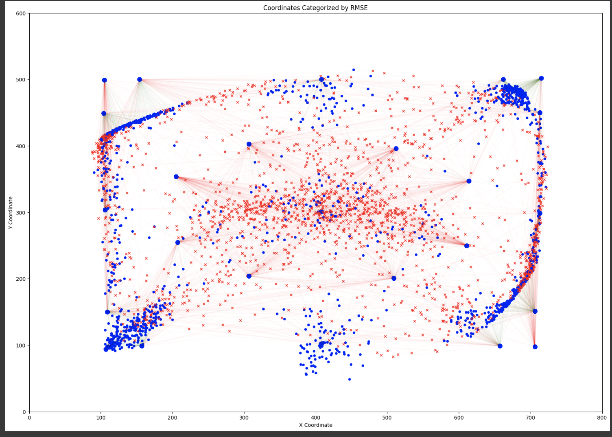

# EEG Deeper Clustered Vision Transformer (EEG-DCViT) 

In the field of EEG-based gaze prediction, the application of deep learning to interpret complex neural data poses significant challenges. This study evaluates the effectiveness of pre-processing techniques and the effect of additional depthwise separable convolution on EEG Vision Transformers (ViTs) in a pretrained model architecture. We introduce a novel method, the EEG Deeper Clustered Vision Transformer (EEG-DCViT), which combines depthwise separable convolutional neural networks (CNNs) with Vision Transformers, enriched by a pre-processing strategy involving data clustering. The new approach demonstrates superior performance, establishing a new benchmark with a Root Mean Square Error (RMSE) of 51.6 mm. This achievement underscores the impact of pre-processing and model refinement in enhancing EEG-based applications.

## Prerequisites

1. **Google Colab Environment**: This script is designed to run in a Google Colab environment. 
2. **Google Drive Storage**: At least 10.40 GB of free space is needed in your Google Drive to store the dataset.
3. **Google Colab GPU**: At least V100 GPU is recommended in Google Colab to reproduce the results accurately.

## Code Implementation Reference
The code implementation in this project includes references to the [EEGViT repository](https://github.com/ruiqiRichard/EEGViT). Specific portions of the code, as presented in the `EEG-DCViT.ipynb` file, are based on or adapted from this repository.

# EEG-DCViT Model Replication Guide

Please note that the `EEG-DCViT.ipynb` notebook contains all necessary requirements and configurations for replicating the results presented. To replicate the results, simply follow the instructions provided within the notebook.

### Step 1 - Open EEG-DCViT.ipynb in Google Collab

### Step 2 - Click Runtime > Run All

## Results Visualisation

Visualization of Test Error

The figure visualizes the coordinates of certain data points, differentiated by a threshold (55.4 mm) applied to their associated Root Mean Square Error (RMSE). Points with RMSE below the threshold are marked in blue and those above in red, with the lines connecting each point to a reference or predicted position, indicating the error magnitude. The dense clustering of blue points suggests a significant proportion of predictions with RMSE below the threshold, indicating accurate model performance. Conversely, the spread of red points signifies instances where the prediction error exceeded the threshold, which could highlight areas for model improvement.

## Results

The deployment of pre-processing and using DS-CNNs has improved the performance of EEG-based predictive models. Our proposed model, in particular, has established new state-of-the-art results, achieving a benchmark RMSE of 51.6 mm. We are optimistic that the significant performance leap made by our model will serve as a cornerstone for future developments in EEG-based brain-computer interfaces and machine learning, inspiring continued innovation and research in the field.

### [EEGEyeNet Absolute Position ](https://arxiv.org/abs/2111.05100)

| Model                                 | Absolute Position RMSE (mm) |
|---------------------------------------|-----------------------------|
| Naive Guessing                        | 123.3 ± 0.0                 |
| CNN                                   | 70.4 ± 1.1                  |
| PyramidalCNN                          | 73.9 ± 1.9                  |
| EEGNet                                | 81.3 ± 1.0                  |
| InceptionTime                         | 70.7 ± 0.8                  |
| Xception                              | 78.7 ± 1.6                  |
| VIT - Base                            | 61.5 ± 0.6                  |
| VIT - Base Pre-trained                | 58.1 ± 0.6                  |
| EEGVIT                                | 61.7 ± 0.6                  |
| EEGVIT Pre - trained                  | 55.4 ± 0.2                  |
| **EEG-DCViT trained with clustered data (EEG-DCViT)** | **51.6 ± 0.2**         |

